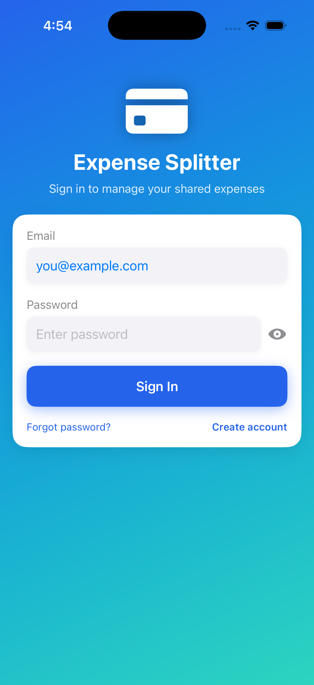
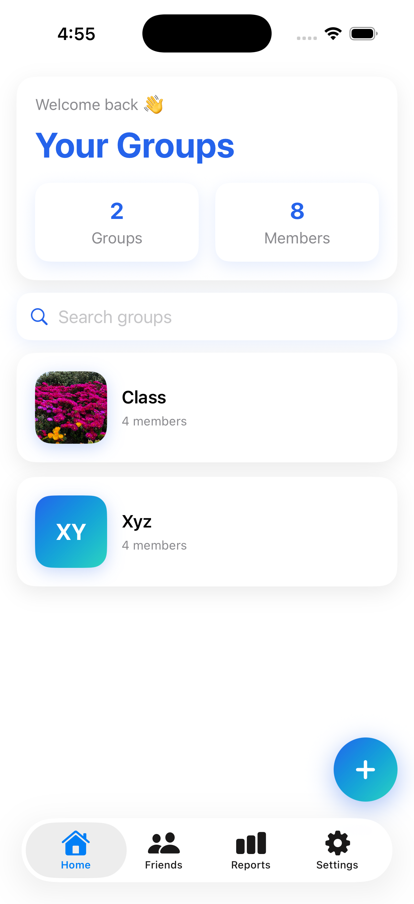
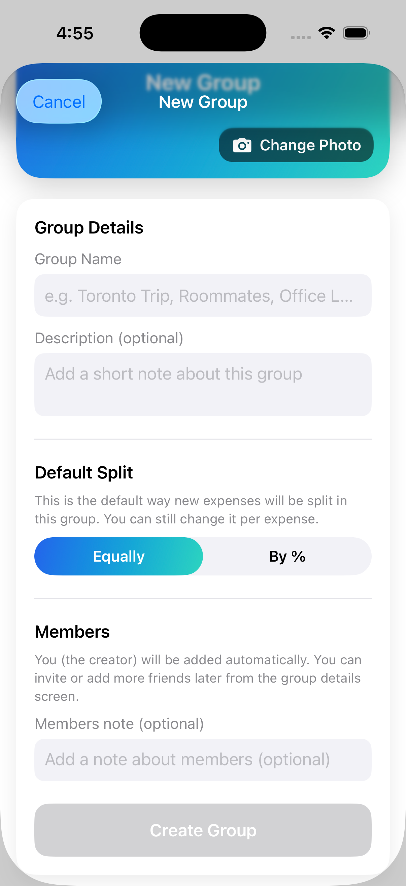
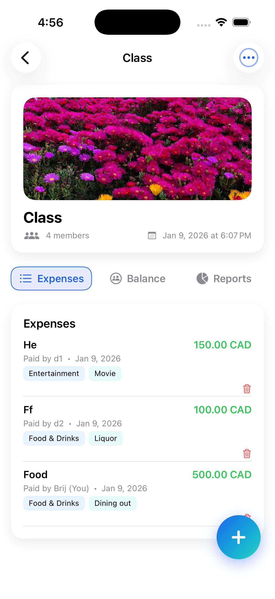
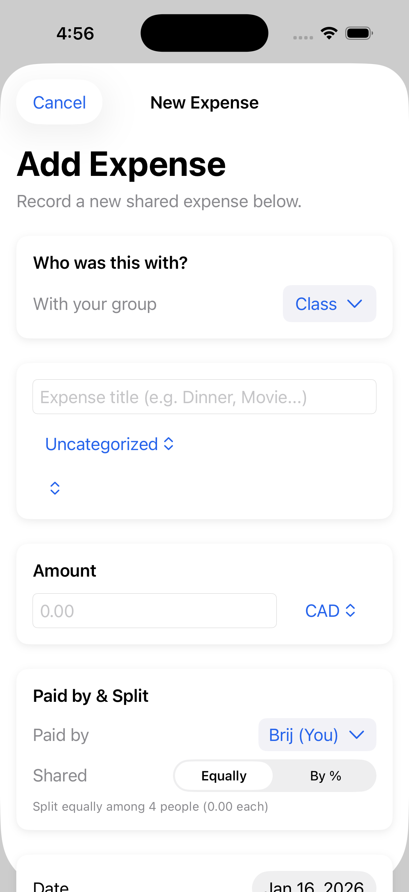
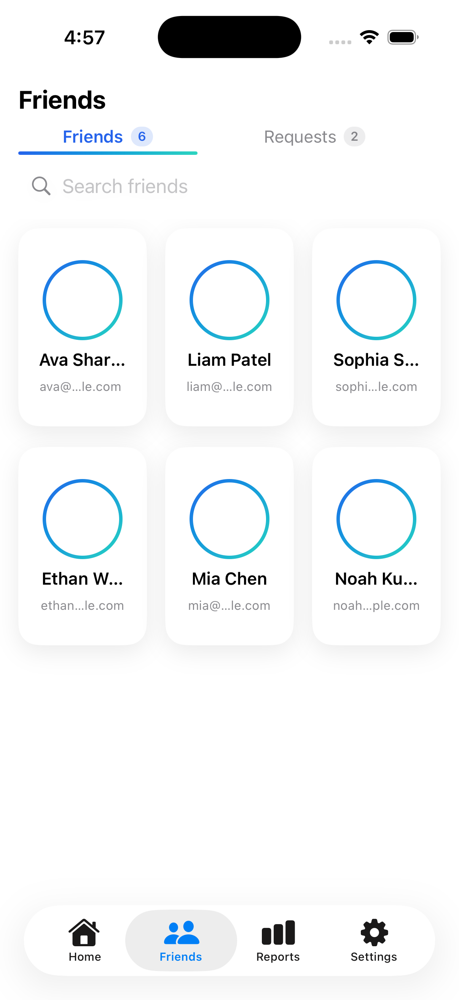
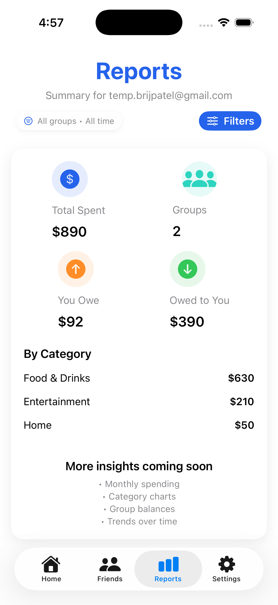
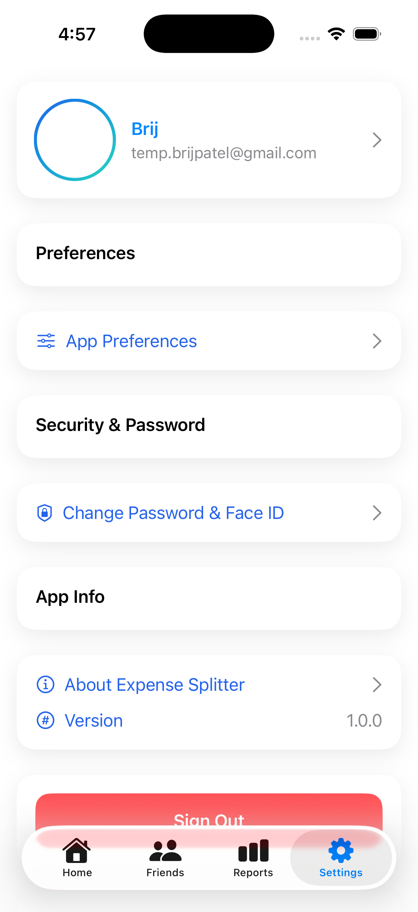

# 📱 Expense Splitter (iOS)

Expense Splitter is a modern iOS application designed to manage shared expenses between friends, families, roommates, or groups.
It focuses on clarity, usability, and real-world scenarios such as trips, classes, shared homes, or group events.

Built using **SwiftUI** and **Firebase**, the app goes beyond basic expense splitting by offering reports, insights, and a polished user experience.

---

## 🎥 Demo Video

▶️ **Full App Walkthrough (5:19 min)**  
https://youtu.be/U39voeKW8mA

---

## ✨ Features

### 🔐 Authentication
- Email & password sign-in / sign-up
- Secure password reset
- Firebase Authentication

### 👥 Groups
- Create multiple groups (Trips, Roommates, Classes, etc.)
- Group image and description
- Add members from friends list
- Admin-only delete and management

### 💸 Expenses
- Add expenses with title, amount, date, and category
- Split expenses equally or by percentage
- Assign who paid
- Delete expenses with confirmation
- Automatic balance calculation

### 🤝 Friends
- Add friends using email
- Accept or reject friend requests
- Card-based friends UI
- Reusable friend list across groups

### 📊 Reports & Insights
- Total amount spent
- You owe vs owed to you
- Category-wise spending breakdown
- Group & time-based filters

### ⚙️ Settings
- Profile overview
- App preferences
- Security & password settings
- App information & version
- Secure sign-out

---

## 🖼 Screenshots

| Sign In | Home |
|--------|------|
|  |  |

| Create Group | Group Details |
|-------------|--------------|
|  |  |

| Add Expense | Friends |
|------------|---------|
|  |  |

| Reports | Settings |
|--------|----------|
|  |  |

---

## 🛠 Tech Stack

- Language: Swift
- UI Framework: SwiftUI
- Architecture: MVVM
- Backend: Firebase Realtime Database
- Authentication: Firebase Auth
- Async Handling: async/await
- Tools: Xcode, Git, GitHub

---

## 🚀 Setup Instructions

### Prerequisites
- macOS
- Xcode 15+
- Firebase account

### Steps

1. Clone the repository
```bash
git clone https://github.com/brijpatel88/ExpenseSplitiOSApp.git
cd ExpenseSplitiOSApp
```

2. Open in Xcode
```bash
open expenseSplitApp.xcodeproj
```

3. Firebase setup
- Enable Email/Password Authentication
- Enable Realtime Database
- Add GoogleService-Info.plist (not committed)

4. Run the app
- Select simulator or device
- Press Run

---

## 🔒 License

**Proprietary License**  
© 2026 Brijesh Patel. All rights reserved.

This project is provided for viewing and evaluation only.
Commercial use, redistribution, or modification is prohibited without explicit written permission.

---

## 🗺 Roadmap

- Monthly & yearly analytics
- Category charts
- Expense export (PDF / CSV)
- Receipt uploads
- Multi-currency support

---

## 👤 Author

**Brijesh Patel**  
GitHub: https://github.com/brijpatel88
